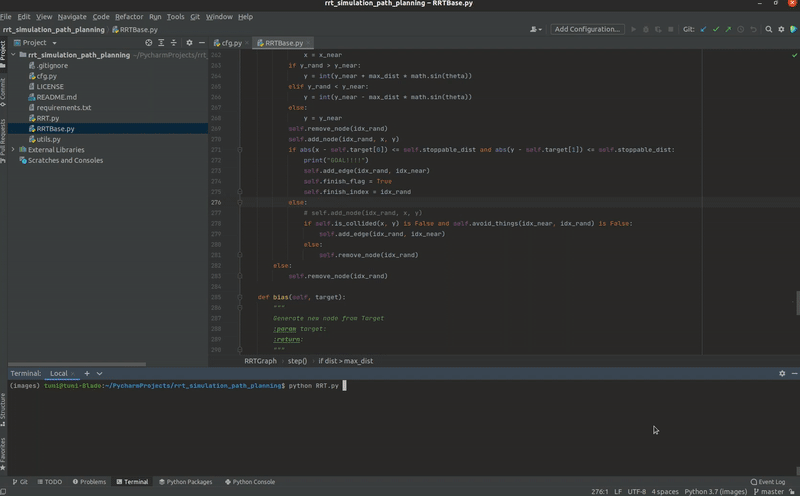
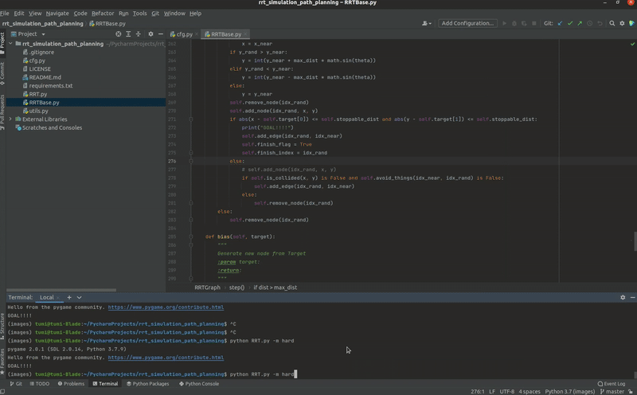

# RRT SIMULATION

Simulate RRT (Rapidly-exploring Random Tree) algorithm with Python in 2 scenarios:
- Easy: no lane, only obstacles
- Hard: complex lanes and obstacles


<p float="left">
  
   
</p>

## Environment 
- Python 3.7
- Ubuntu 20.04

## Requirements
Install necessary packages followed ```requirements.txt```
```
pip install -r requirements.txt
```

## How to use

### Configure properties in ```cfg.py```: 
- start node
- target node
- obstacle size
- number of obstacles
- etc., 

### Run simulation

- Easy Mode (default):
    ```
    python RRT.py 
    ```
    or
    ```
    python RRT.py -m easy
    ```
- Hard Mode:
    ```
    python RRT.py -m hard
    ```

Code for the RRT* is **[here](https://github.com/tuminguyen/RRT_Star_Simulation)**